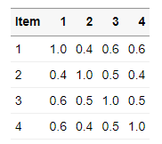
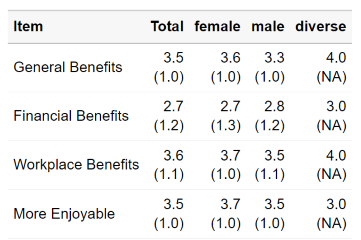

<!-- README.md is generated from README.Rmd. Please edit that file -->

```{r, include = FALSE}
knitr::opts_chunk$set(
  collapse = TRUE,
  comment = "#>",
  fig.path = "man/figures/README-",
  out.width = "100%"
)
```

# volkeR-Package


<!-- badges: start -->
[](https://lifecycle.r-lib.org/articles/stages.html#experimental)
<!-- badges: end -->


*Work in progress: not everything has been implemented yet!* 

This package contains functions for creating summaries and graphics for survey data. It summarises functions used in the the textbook [Einfache Datenauswertung mit R](https://doi.org/10.1007/978-3-658-34285-2) (Gehrau & Maubach et al., 2022), which provides an introduction to univariate and bivariate statistics and data representation using RStudio and R Markdown.

## Concept

The VolkeR package is made for creating quick and easy overviews of data sets. 
It is especially useful for survey data. Before selecting the functions, consider:


- *Table or plot?*  
  A plot is quick to capture, data from a table is better for further calculations. If in doubt, create both.
  Functions for tables start with 'tab', functions for plots with 'plot'.
  
- *Categorical or metric variables?*   
  Categories can be counted, for metric variables distribution parameters like mean and standard deviation are calculated.
  Functions for categorical variables contain `counts` in their name, those for metric `metrics`.
  
- *One variable or item batteries?*.  
  Item batteries are often used in surveys. Each item results in a single variable, but the variables are all measured with the same scale.
  All items can be summarized in a table: either by using `tab_item_counts()` to count the values for each item (e.g. 1=not at all to 5=fully) 
  or by using `tab_item_metrics()` to calculate distribution parameters (e.g. mean of responses, each going from 1 to 5). 
  
- *Individual or grouped?*  
When metric variables are grouped, groups can be compared (e.g., the average age by gender) using the `tab_group_metrics()` function.
When categorical variables are grouped, cross-tabulations are created (e.g., combinations of education level and gender), which can be generated with the `tab_group_counts()` function.
To represent relationships between many variables, you can either compare all means of items between groups using `tab_multi_means()` or output correlation matrices using `tab_multi_corr()`.

- *Markdown or dataframe?*  
  All table functions return dataframes that can be stored in objects and processed further. The tables have their own print function, so the output of all functions can be used directly in Markdown documents to display formatted tables. To do this, you need to set the `results='asis'`parameter in the code chunk, as shown in the [examples in vignette](vignettes/introduction.Rmd).

## Special features

- Simple tables, simple plots.
- Tidyverse compatible.
- Automatic labeling and scaling based on attributes. Appropriate attributes, for example, are provided by the Sosci Survey API. Alternatively, you can add custom labels.
- Calculate metric indexes
- Simplified hints for wrong parameters, e.g. if you forget to provide a data frame (work in progress)
- Switch between tables and plots in Markdown reports
- Simple reporting interface: the report() function rules them all.

## Examples

*Frequencies and distributions (univariable)*  

<table>
<tbody>
<tr>
<td></td>
<td><strong>Metric</strong></td>
<td><strong>Categorical</strong></td>
</tr>
<tr>
<td><strong style="display: block;transform: rotate(-90deg);">One variable</strong></td>
<td valign="top"><code>tab_var_metrics()</code><br></td>
<td valign="top"><code>tab_var_counts()</code><br></td>
</tr>
<tr>
<td><strong style="display: block;transform: rotate(-90deg);">Multiple items</strong></td>
<td valign="top"><code>tab_item_metrics()</code><br></td>
<td valign="top"><code>tab_item_counts()</code><br></td>
</tr>
</tbody>
</table>

*Correlations and comparisons (multivariable)*  

<table>
<tbody>
  <tr>
    <td></td>
    <td><strong>Metric & x</strong></td>
    <td><strong>Categorical & x</strong></td>
  </tr>
  <tr>
    <td><strong style="display: block;transform: rotate(-90deg);">Two variables</strong></td>
    <td valign="top"><code>tab_group_metrics()</code><br></td>
    <td valign="top"><code>tab_group_counts()</code><br></td>
  </tr>
  <tr>
    <td><strong style="display: block;transform: rotate(-90deg);">Multiple items</strong></td>
    <td valign="top"><code>tab_multi_corr()</code><br></td>
    <td valign="top"><code>tab_multi_means()</code><br></td>
  </tr>
</tbody>
</table>
<br>
<br>


All functions take a data frame as their first argument, followed by column selections, e.g.:  

```
tab_multi_means(
  data,
  starts_with("cg_adoption_advantage"),
  sd_gender
)
```

For more example code, see the [introductionary vignette](vignettes/introduction.Rmd). 


## Installation
As with all other packages you'll have to install the package first.
You can install the development version from GitHub using remotes:

```
if (!require(remotes)) { install.packages("remotes") }
remotes::install_github("strohne/volker")
```

After installing the package, load it:
```
library(volker)

```

Finally, use it:

```
# Example data
data <- volker::chatgpt

# Example table
tab_group_metrics(data, sd_alter, sd_geschlecht)

```


## Troubleshooting

The kableExtra package produces an error in R 4.3 when knitting documents: ` .onLoad in loadNamespace() für 'kableExtra' fehlgeschlagen`. As a work around, remove PDF and Word settings from the output options in you markdown document (the yml section at the top).

## Roadmap

| Version | Features                 | Status           |  
| ------- | ------------------------ | ---------------- |  
| 1.0     | Descriptive tables       | work in progress | 
| 1.1     | Descriptive plots        | work in progress |  
| 1.2     | Regression tables        | work in progress |  
| 1.3     | Sosci Survey integration | work in progress |  
| 1.4     | Topic modeling           | work in progress |  

## Similar packages

https://github.com/kassambara/rstatix


## Authors and citation

**Author**  
Jakob Jünger  

**Contributers**  
Henrieke Kotthoff

**Citation**  
Jünger, J. (2024). volker: Report summaries and graphics for survey data. R package version 1.0.
