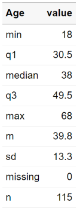
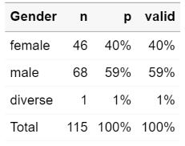
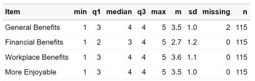
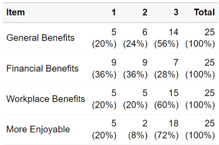
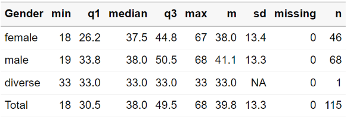
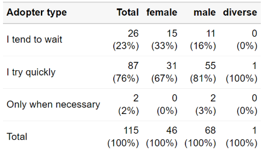

<!-- README.md is generated from README.Rmd. Please edit that file -->

```{r, include = FALSE}
knitr::opts_chunk$set(
  collapse = TRUE,
  comment = "#>",
  fig.path = "man/figures/README-",
  out.width = "100%"
)
```

# volkeR-Package


<!-- badges: start -->
[](https://lifecycle.r-lib.org/articles/stages.html#experimental)
<!-- badges: end -->

High-level functions for for summarising, charting and reporting survey data. 


## Getting started

```
# Install the package (see below), then load it
library(volker)

# Load example data from the package
data <- volker::chatgpt

# Create your first plot counting answers to an item battery
plot_counts(data, starts_with("cg_adoption_social"))

# Create your first table summarizing the item battery
tab_metrics(data, starts_with("cg_adoption_social"))

```

See further [examples in the introduction vignette](vignettes/introduction.Rmd).


## Concept

The volkeR package is made for creating quick and easy overviews about datasets. 
It handles standard cases with a handful of functions:


- *Table or plot?*  
  A plot is quick to capture, data from a table is better for further calculations. If in doubt, create both at once with the report()-function.
  Functions for tables start with 'tab', functions for plots with 'plot'.
  
- *Categorical or metric variables?*   
  Categories can be counted, for metric variables distribution parameters such as the mean and standard deviation are calculated.
  Functions for categorical variables contain `counts` in their name, those for metric `metrics`.
  
- *Individual or grouped?*  
Groups can be compared (e.g., the average age by gender) or crosstabulated (e.g. combinations of education level and gender) by providing a grouping column as third parameter of table and plot functions.

- *One variable or item batteries?*.  
  Item batteries are often used in surveys. Each item results in a single variable, but the variables are all measured with the same scale (e.g. 1 = not at all to 5 = fully applies).
  To summarize multiple items send a column selection to the functions by using tidyselect mechanisms such as `starts_with()`.
  
- *Markdown or dataframe?*  
  All table functions return dataframes that can be stored in objects and processed further. The tables have their own print function, so the output of all functions can be used directly in Markdown documents to display formatted tables. 
  


## Examples


<table>
<tbody>
<tr>
<td></td>
<td><strong>Metric</strong></td>
<td><strong>Categorical</strong></td>
</tr>
<tr>
<td><strong style="display: block;transform: rotate(-90deg);">One variable</strong></td>
<td valign="top">
```
tab_metrics(data, sd_age)
```

</td>
<td valign="top">
```
tab_counts(data, sd_gender)
```

</td>
</tr>

<tr>
<td><strong style="display: block;transform: rotate(-90deg);">Multiple items</strong></td>
<td valign="top">  
```
tab_metrics(data, starts_with("cg_adoption"))
```

</td>
<td valign="top">
```
tab_counts(data, starts_with("cg_adoption"))
```

</td>
</tr>

<tr>
<td><strong style="display: block;transform: rotate(-90deg);">Group comparison </strong></td>
<td valign="top">
```
tab_metrics(data, sd_age, sd_gender)
```

</td>
<td valign="top">
```
tab_counts(data, in_adoption, sd_geschlecht)
```

</td>
</tr>
</tbody>
</table>
<br>

All functions take a data frame as their first argument, followed by column selections, and optionally a grouping column. Example:

```
tab_metrics(
  data,
  starts_with("cg_adoption_advantage"),
  sd_gender
)
```

For more example code, see the [introductionary vignette](vignettes/introduction.Rmd). 


## Installation
As with all other packages you'll have to install the package first.
You can install the development version from GitHub using remotes:

```
if (!require(remotes)) { install.packages("remotes") }
remotes::install_github("strohne/volker")
```

After installing the package, load it:
```
library(volker)

```

Finally, use it:

```
# Example data
data <- volker::chatgpt

# Example table
tab_metrics(data, sd_alter, sd_geschlecht)

```


## Special features

- Simple tables, simple plots.
- Automatic labeling and scaling based on attributes. Appropriate attributes, for example, are provided by the Sosci Survey API. Alternatively, you can add custom labels.
- Calculate metric indexes
- Simplified hints for wrong parameters, e.g. if you forget to provide a data frame (work in progress)
- Simple reporting interface: the report() function rules them all. Switch between tables and plots in Markdown reports
- Tidyverse style.

## Troubleshooting

The kableExtra package produces an error in R 4.3 when knitting documents: ` .onLoad in loadNamespace() für 'kableExtra' fehlgeschlagen`. As a work around, remove PDF and Word settings from the output options in you markdown document (the yml section at the top).

## Roadmap

| Version | Features                 | Status           |  
| ------- | ------------------------ | ---------------- |  
| 1.0     | Descriptive tables       | work in progress | 
| 1.1     | Descriptive plots        | work in progress |  
| 1.2     | Sosci Survey integration | work in progress |  
| 1.3     | Regression tables        | work in progress |  
| 1.4     | Topic modeling           | work in progress |  

## Similar packages

https://github.com/joon-e/tidycomm

https://github.com/kassambara/rstatix


The volker package is inspired by outputs used in the the textbook [Einfache Datenauswertung mit R](https://doi.org/10.1007/978-3-658-34285-2) (Gehrau & Maubach et al., 2022), which provides an introduction to univariate and bivariate statistics and data representation using RStudio and R Markdown.

## Authors and citation

**Author**  
Jakob Jünger  

**Contributers**  
Henrieke Kotthoff

**Citation**  
Jünger, J. (2024). volker: Report summaries and graphics for survey data. R package version 1.0.
