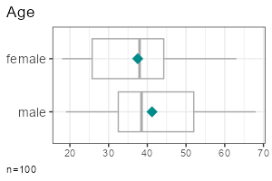
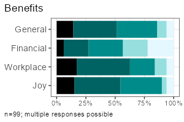

<!-- README.md is generated from README.Rmd. Please edit that file -->

```{r, include = FALSE}
knitr::opts_chunk$set(
  collapse = TRUE,
  comment = "#>",
  fig.path = "man/figures/README-",
  out.width = "100%"
)
```

# volkeR-Package 

<!-- badges: start -->

[](https://lifecycle.r-lib.org/articles/stages.html#experimental) 
[](https://github.com/strohne/volker/actions/workflows/R-CMD-check.yaml) 
[](https://app.codecov.io/github/strohne/volker)
[](https://CRAN.R-project.org/package=volker) 
<!-- badges: end -->

High-level functions for tabulating, charting and reporting survey data.

## Getting started

[](https://www.youtube.com/@volkerpackage)


```{r, eval=FALSE}         
# Install the package (see below), then load it
library(volker)

# Load example data from the package
data <- volker::chatgpt

# Create your first table and plot, counting answers to an item battery
report_counts(data, starts_with("cg_adoption_social"))

# Create your first table and plot, reporting mean values of the item battery
report_metrics(data, starts_with("cg_adoption_social"))
```

See further examples in `vignette("introduction", package="volker")`.

Don't miss the template feature: Within RStudio, create a new Markdown
document, select `From template`, choose and finally knit the **volkeR
Report**! It's a blueprint for your own tidy reports.
<br>
<br>


## Concept

The volkeR package is made for creating quick and easy overviews about
datasets. It handles standard cases with a handful of functions.
Basically you select one of the following functions and throw your data
in:

- **Categorical variables**: `report_counts()`
- **Metric variables**: `report_metrics()`

The report functions combine tables, plots and, optionally, effect size calculations. To request only one of those outputs, directly use the respective function:

- **Charts**: `plot_metrics()` and `plot_counts()`\
- **Tables**: `tab_metrics()` and `tab_counts()`\
- **Effects**: `effect_metrics()` and `effect_counts()`\

Which one is best?
That depends on your objective:

-   *Table or plot?*\
    A plot is quick to capture, data from a table is better for further
    calculations. Functions for tables start with `tab`, functions for
    plots with `plot`. If in doubt, create both at once with the
    `report`-functions.

-   *Categorical or metric variables?*\
    Categories can be counted, for metric variables distribution
    parameters such as the mean and standard deviation are calculated.
    Functions for categorical variables contain `counts` in their name,
    those for metric `metrics`.

-   *Individual, grouped or correlated?*\
    Groups can be compared (e.g., the average age by gender) or
    cross-tabulated (e.g. combinations of education level and gender) by
    providing a grouping column as third parameter of table, plot and
    report functions. To calculate correlations and show scatter plots, 
    provide a metric column and set the metric-Paramter to TRUE. 
    The effect-functions calculate effect sizes and statistical tests 
    for group comparisons and correlations.
    
-   *One variable or item batteries?*.\
    Item batteries are often used in surveys. Each item results in a
    single variable, but the variables are all measured with the same
    scale (e.g. 1 = not at all to 5 = fully applies). To summarise
    multiple items send a column selection to the functions by using
    tidyselect mechanisms such as `starts_with()`. 
    
-   *Markdown or data frame?*\
    All table functions return data frames that can be processed
    further. The tables have their own print function, so the output of
    all functions can be used directly in Markdown documents to display
    neatly formatted tables and plots. The `report`-functions create
    tidy interactive tabsheets to switch between plots, tables, and
    indexes.

## Examples

<table>
<tbody>
<tr>
<td></td>
<td><strong>Metric</strong></td>
<td><strong>Categorical</strong></td>
</tr>
<tr>
<td style="vertical-align:middle"><strong style="display: inline-block;transform: rotate(-90deg);">One variable</strong></td>
<td valign="top">

</td>
<td valign="top">

</td>
</tr>

<tr>
<td style="vertical-align:middle"><strong style="display: inline-block;transform: rotate(-90deg);">Group comparison </strong></td>
<td valign="top">


</td>
<td valign="top">


</td>
</tr>


<tr>
<td style="vertical-align:middle"><strong style="display: inline-block;transform: rotate(-90deg);">Multiple items</strong></td>
<td valign="top">  


</td>
<td valign="top">


</td>
</tr>

</tbody>
</table>

<br>

All functions take a data frame as their first argument, followed by
a column selection, and optionally a grouping column. 
Reproduce the examples above:

-   One metric variable: `report_metrics(data, sd_age)`\
-   One categorical variable: `report_counts(data, sd_gender)`\
-   Grouped metric variable: `report_metrics(data, sd_age, sd_gender)`\
-   Grouped categorical variable: `report_counts(data, adopter, sd_gender)`\
-   Multiple metric variables: `report_metrics(data, starts_with("cg_adoption"))`\
-   Multiple categorical variables: `report_counts(data, starts_with("cg_adoption"))`


The column selections determine which type of output is generated. 
In the second parameter (after the dataset), you can either provide a single column or a selection of multiple items. 
To compare groups, provide an additional categorical column in the third parameter. 
To calculate correlations, provide a metric column in the third parameter and set the `metric` parameter to `TRUE`.

Note: Some column combinations are not implemented yet.


## Effect sizes and statistical tests

Calculate effect sizes and conduct basic statistical tests using `effect_counts()` and `effect_metrics()`. Effect calculation is included in the reports if you request it by the effect-parameter, for example:

```{r, eval=FALSE}
report_counts(data, adopter, sd_gender, prop = "cols", effect = TRUE)
```  

**A word of warning:** Statistics is the world of uncertainty. All procedures require mindful interpretation. Counting stars might evoke illusions.

## Factors and Clusters  

You can generate tables and plots for clustering and factor analysis of metric variables. Both clustering and factor analysis are included in the reports when requested using the factors or clusters parameters.


Set the respective parameters to TRUE to generate a scree plot and let the diagnostics choose the optimal number:

```{r, eval=FALSE}

report_metrics(data, starts_with("cg_adoption"), factors = TRUE, clusters = TRUE)

```  


Set the desired number directly:

```{r, eval=FALSE}

report_metrics(data, starts_with("cg_adoption"), factors = 3, clusters = 4)

```  

You don't need to add both parameters at the same time if you are only interested in factors or clusters.

## Modeling: Regression and Analysis of Variance

Modeling in the statistical sense is predicting an outcome (dependent variable) from one or multiple predictors (independent variables).

The report_metrics() function calculates a linear model if the `model` parameter is set to `TRUE`. You provide the variables in the following parameters:

- Dependent metric variable: first parameter (a single column).  
- Independent categorical variables: second parameter (a tidy column selection).  
- Independent metric variables: `metric` parameter (a tidy column selection).  
- Interaction effects: interactions parameter with a vector of multiplication terms (e.g. `c(sd_age * sd_gender)`).  


```{r, eval=FALSE}
ds |>
 filter(sd_gender != "diverse") |>
 report_metrics(
   use_work, 
   cross = c(sd_gender, adopter), 
   metric = sd_age,
   model = TRUE, diagnostics = TRUE
 )
```

Four selected diagnostic plots are generated if the `diagnostics` parameter is set to `TRUE`:

- Residual vs. fitted: Residuals should be evenly distributed vertically. Horizontally, they should follow the straight line. 
  Otherwise this could be an indicator for heteroscedasticity, non-linearity, or autocorrelation.
- Scale-location plot: Points should be evenly distributed without any visible pattern, similar to the residual plot.
- Q-Q-Plot of fitted values: All points should lie along a straight line.
Deviations may suggest non-linearity or that residuals are not normally distributed. 
- Cook's distance plot: High values indicate that single cases influence the model disproportionately. Rule of thumb: Cook's distance > 1 is a problem.

To work with the predicted values, use `add_model()` instead of the report function.
This will add a new variable prefixes with `prd_`, holding the target scores.


```{r, eval=FALSE}
ds <- ds |> add_model(
   use_work,
   categorical = c(sd_gender, adopter), 
   metric = sd_age
 )

report_metrics(ds, use_work, prd_use_work, metric = T)
```


There are two functions to get the regression table or plot from the new column: 

```{r, eval=FALSE}

model_tab(ds, prd_use_work)
model_plot(ds, prd_use_work)

```


By default, p-values are adjusted to the number of tests by controlling the false discovery rate (fdr). Set the `adjust` parameter to `FALSE` to disable p-value correction.

## Reliability Scores (and Classification Performance Indicators)

In content analysis, reliability is usually checked by coding the cases with different persons
and then calculating the overlap. To calculate reliability scores, prepare one data frame for each person:  

- All column names in the different data frames should be identical.  
  Codings must be either binary (`TRUE`/`FALSE`) or 
  contain a fixed number of values such as "sports", "politics", "weather".  
- Add a column holding initials or the name of the coder.  
- One column must contain unique IDs for each case (e.g., a running case number).  

Next, you row-bind the data frames. The coder and ID columns ensure that each coding can be uniquely matched to both the coder and the case.

```{r, eval=FALSE}

data_coded <- bind_rows(
  data_coder1,
  data_coder2
)

```

The final data, for example, looks like:

| case | coder | topic_sports | topic_weather |
| ---- | ----- | ------------ | ------------- |
|    1 | anne  | TRUE         | FALSE         |
|    2 | anne  | TRUE         | FALSE         |
|    3 | anne  | FALSE        | TRUE          |
|    1 | ben   | TRUE         | TRUE          |
|    2 | ben   | TRUE         | FALSE         |
|    3 | ben   | FALSE        | TRUE          |


Calculating reliability is straightforward with `report_counts()`:  

- Provide the data to the first parameter.  
- Add the column with codings (or a selection of multiple columns, e.g. using `starts_with()`) 
  to the second parameter.  
- Set the the third parameter to the column name with coder names or initials.  
- Set the `ids` parameter to the column that contains case IDs or case numbers 
  (this tells the volker-package which cases belong together).  
- Set the `agree` parameter to "reliability" to request reliability scores.  

Example:

```{r, eval=FALSE}

report_counts(data_coded, starts_with("topic_"), coder, ids = case, prop = "cols", agree = "reliability")

```

If you are only interested in the scores (without a plot), use `agree_tab`. 
Tip: You may abbreviate the method name (e.g., "reli" instead of "reliability").

```{r, eval=FALSE}

agree_tab(data_coded, starts_with("topic_"), coder, ids = case, method = "reli")

```

You can also request classification performance indicators 
(accuracy, precision, recall, F1) with the same function by setting the `method` parameter 
to "classification" (may be abbreviated). 
Use this option when comparing manual codings with automated codings (e.g., classifiers or large language models).
By default, you get macro statistics (average precision, recall and f1 across categories).

If you have multiple values in a column, you can focus on one category to get micro statistics:

```{r, eval=FALSE}

agree_tab(data_coded, starts_with("topic_"), coder, ids = case, method = "class", category = "catcontent")

```

## Where do all the labels go?

One of the strongest package features is labeling.
You know the pain.
Labels are stored in the column attributes.
Inspect current labels of columns and values by the `codebook()`-function:

```{r, eval=FALSE}
codebook(data)
```

This results in a table with item names, item values, value names and
value labels. 

You can set specific column labels by providing a named list to the items-parameter of `labs_apply()`:


```{r, eval=FALSE}
data %>%
  labs_apply(
    items = list(
      "cg_adoption_advantage_01" = "General advantages",
      "cg_adoption_advantage_02" = "Financial advantages",
      "cg_adoption_advantage_03" = "Work-related advantages",
      "cg_adoption_advantage_04" = "More fun"
    )
  ) %>% 
  tab_metrics(starts_with("cg_adoption_advantage_"))

```


Labels for values inside a column can be adjusted by providing a named list to the values-parameter of `labs_apply()`. In addition, select the columns where value labels should be changed:

```{r, eval=FALSE}

data %>%
  labs_apply(
    cols = starts_with("cg_adoption"),  
    values = list(
      "1" = "Strongly disagree",
      "2" = "Disagree",
      "3" = "Neutral",
      "4" = "Agree",
      "5" = "Strongly agree"
    ) 
  ) %>% 
  plot_metrics(starts_with("cg_adoption"))

```

To conveniently manage all labels of a dataset, 
save the result of `codebook()` to an Excel file,
change the labels manually in a copy of the Excel file, 
and finally call `labs_apply()` with your revised codebook.

```{r, eval = FALSE}

library(readxl)
library(writexl)

# Save codebook to a file
codes <- codebook(data)
write_xlsx(codes,"codebook.xlsx")

# Load and apply a codebook from a file
codes <- read_xlsx("codebook_revised.xlsx")
data <- labs_apply(data, codes)

```


Be aware that some data operations such as `mutate()` from the tidyverse
loose labels on their way. In this case, store the labels (in the
codebook attribute of the data frame) before the operation and restore
them afterwards:

```{r, eval=FALSE}
data %>%
  labs_store() %>%
  mutate(sd_age = 2024 - sd_age) %>% 
  labs_restore() %>% 
  
  tab_metrics(sd_age)
```

## SoSci Survey integration
The labeling mechanisms follow a technique used, for example, on [SoSci Survey](https://www.soscisurvey.de/).
Sidenote for techies: Labels are stored in the column attributes.
That's why you can directly throw in labeled data from the SoSci Survey API:

```{r, eval=FALSE}         
library(volker)

# Get your API link from SoSci Survey with settings "Daten als CSV für R abrufen"
eval(parse("https://www.soscisurvey.de/YOURPROJECT/?act=YOURKEY&rScript", encoding="UTF-8"))

# Generate reports
report_counts(ds, A002)
```

For best results, use sensible prefixes and captions for your SoSci
questions. The labels come directly from your questionnaire.

*Please note:* The values `-9`, `-2`, `-1` and `[NA] nicht beantwortet`, `[NA] keine Angabe`, `[no answer]` are automatically recoded to missing values within all plot, tab, effect, and report
functions. See the clean-parameter help how to disable automatic residual removal. 

## Customization

You can change plot colors using the `theme_vlkr()`-function:

```{r, eval=FALSE}
theme_set(
  theme_vlkr(
    base_fill = c("#F0983A","#3ABEF0","#95EF39","#E35FF5","#7A9B59"),
    base_gradient = c("#FAE2C4","#F0983A")
  )
)
```

Plot and table functions share a number of parameters that can be used to customize the outputs. Lookup the available parameters in the help of the specific function.

### Data preparation  

- **ordered**: Sometimes categories have an order, from low to high or from few to many. It helps visual inspections to plot ordered values with shaded colors instead of arbitrary colors. For frequency plots, you can inform the method about the desired order. By default the functions try to automatically detect a sensitive order.
- **category**: When you have multiple categories in a column, you can focus one of the categories to simplify the plots and tables. By default, if a column has only TRUE and FALSE values, the outputs focus the TRUE category.
- **clean** Before all calculations, the dataset goes through a cleaning plan that, for example, recodes residual factor values such as "[NA] nicht beantwortet" to missings. In surveys, negative values such as -9 or -2 are often used to mark missing values or residual answers ("I don't know"). See the help for further details or disable data cleaning if you don't like it. For example, to disable removing the negative residual values, call `options(vlkr.na.numbers=FALSE)` and `options(vlkr.na.levels=FALSE)`. Rows with missing values in the analyzed columns are, by default, removed before producing tables or plots. To prevent this and to use the maximum available information, call `options(vlkr.na.omit=FALSE)`. From this point on, for example, item summaries are calculated using all values available for each single item. The outputs contain hints about cases with missing data.

### Calculations

- **prop**: Calculating percentages in a cross tab requires careful selection of the base. You can choose between total, row or column percentages. For stacked bar charts, displaying row percentages instead of total percentages gives a direct visual comparison of groups.
- **ci**: Add confidence intervals to plot and table outputs.
- **index**: Indexes (=mean of multiple items) can be added to a dataset using `add_index()` or, 
using the index-parameter, automatically be included in report functions. Cronbach's alpha is added to all table outputs.
- **factors**: Items can be condensed to factors using principal component analysis. With `add_factors()` new columns are added. The factors-parameter in the report_metrics function automatically adds a factor analysis to the outputs. 
- **clusters**: Cases can be grouped to clustersusing kmeans cluster analysis. With `add_clusters()` a new column indicating cluster groups is added. The clusters-parameter in the report_metrics function automatically adds a cluster analysis to the outputs.
- **effect**: You are not sure whether the differences are statistical significant? One option is to look out for non overlapping confidence intervals. In addition, the effect option calculates effect sizes such as Cramer's v or R squared and generates typical statistical tests such as Chi-squared tests and t-tests.
- **method**: By default, correlations are calculated using Pearson's R. You can choose Spearman's Rho with the methods-parameter. For cooccurrence analysis of categories (you provide two variable sets to `report_counts()`), you can choose between Cramer's V (items are compared with items) or NPMI (the single item values are compared). In this case, we recommend to also set the tiles-parameter to TRUE for generating a heatmap (the default are bar plots). Normalized pointwise mutual information helps spotting combinations that are more rare (negative values) or more frequent (positive values) than expected by chance. You can add "npmi" to the numbers parameter to plot the values on the tiles. 
- **adjust**: Performing multiple significance tests inflates the alpha error.
  Thus, p values need to be adjusted according to the number of tests. By default, the false discovery rate is controlled (fdr). You can, for example, choose Bonferroni-correction or disable correction.

### Labeling  

- **title**: All plots usually get a title derived from the column attributes or column names. Set to FALSE to suppress the title or provide a title of your choice as a character value.  
- **labels**: Labels are extracted from the column attributes, if present. Set to FALSE to output bare column names and values.

### Tables
- **percent**: Frequency tables show percentages by default. Set to FALSE to get raw proportions - easier to postprocess in further calculations.
- **digits**: Tables containing means and standard deviations by default round values to one digit. Increase the number to show more digits.
- **values**: The more variables you desire, the denser the output must be. Some tables try to serve you insights at the maximum and show two values in one cell, for example the absolute counts (n) and the percentages (p), or the mean (m) and the standard deviation (sd). Control your desire with the values-parameter.

### Plots
- **numbers**: Bar plots give quick impressions, tables provide exact numbers. In bar charts you can combine both and print the frequencies onto the bars. Set the numbers parameter to "n", "p" or c("n","p"). To prevent cluttering and overlaps, numbers are only plotted on bars larger than 5%.
- **limits**: Do you know how to create misleading graphs? It happens when you truncate the minimum or maximum value in a scale. The scale limits are automatically guessed by the package functions (work in progress). Use the limits-parameter to manually fix any misleading graphs.
- **box**: In metric plots you can visualise the distribution by adding boxplots.
- **log**: Metric values having long tail distributions are not easy to visualise. In scatter plots, you can use a logarithmic scale. Be aware, that zero values will be omitted because their log value is undefined.
- **width**: In stacked plots with column or row proportions, by default, the column or bar widths mirror the group size. Set to FALSE to produce equal widths.
- **tiles**: The default plot for two categorical variables is a bar plot. Alternatively, generate a heat map.


## Installation

As with all other packages you'll have to install the package first.

```{r, eval=FALSE}         
install.packages("strohne/volker")
```

You can try alternative versions:  

- If you want, install the main version from GitHub using
  remotes, which may include features not yet published on CRAN (if asked,
  skip the updates):
  ```{r, eval=FALSE}         
  if (!require(remotes)) { install.packages("remotes") }
  remotes::install_github("strohne/volker", upgrade="never", build_vignettes = TRUE)
  ```

- In case you are adventurous, try the latest experimental development
  version which lives in the devel branch (if asked, skip the updates):
  ```{r, eval=FALSE}         
  if (!require(remotes)) { install.packages("remotes") }
  remotes::install_github("strohne/volker", ref="devel", upgrade="never", build_vignettes = TRUE)
  ```

## Special features

-   Simple tables, simple plots, simple reports.\
-   Labeling and scaling based on attributes. Appropriate attributes,
    for example, are provided by the SoSci Survey API. Alternatively,
    you can add custom labels. Use `codebook()` to see all labels
    present in a dataset.\
-   Interactive reports: Use the `volker::html_report` template in your
    Markdown documents to switch between tables and plots when using the
    report-functions.\
-   Generate metric indexes, conduct simple factor and cluster analyses 
    and calculate effect sizes\
-   Simplified hints for wrong parameters, e.g. if you forget to provide
    a data frame (*work in progress*).
-   Tidyverse style.

## Troubleshooting

The kableExtra package produces an error in R 4.3 when knitting
documents: `.onLoad in loadNamespace() für 'kableExtra' fehlgeschlagen`.
As a work around, remove PDF and Word settings from the output options
in you markdown document (the yml section at the top). Alternatively,
install the latest development version:

```         
remotes::install_github("kupietz/kableExtra")
```

## Roadmap

| Version | Features           | Status           |
|---------|--------------------|------------------|
| 1.0     | Descriptives       | 90% done         |
| 2.0     | Effects            | 75% done         |
| 3.0     | Factors & clusters | 80% done         |
| 4.0     | Linear models      | 50% done         |
| 5.0     | Text analysis      | work in progress |

## Similar packages

The volker package is inspired by outputs used in the textbook
[Einfache Datenauswertung mit
R](https://doi.org/10.1007/978-3-658-34285-2) (Gehrau & Maubach et al.,
2022), which provides an introduction to univariate and bivariate
statistics and data representation using RStudio and R Markdown.

Other packages with high-level reporting functions:\
- <https://github.com/tidycomm/tidycomm>\
- <https://github.com/kassambara/rstatix>\
- <https://github.com/easystats/easystats>

## Authors and citation

**Authors**\
Jakob Jünger (University of Münster)\
Henrieke Kotthoff (University of Münster)\

**Contributers**\
Chantal Gärtner (University of Münster)

**Citation**\
Jünger, J. & Kotthoff, H. (2024). volker: High-level functions for tabulating, charting and reporting survey data. R package version 3.0.

