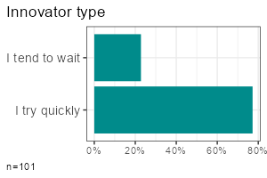
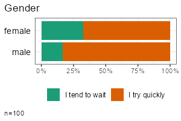
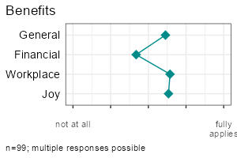

<!-- README.md is generated from README.Rmd. Please edit that file -->

```{r, include = FALSE}
knitr::opts_chunk$set(
  collapse = TRUE,
  comment = "#>",
  fig.path = "man/figures/README-",
  out.width = "100%"
)
```

# volkeR-Package 

<!-- badges: start -->

[](https://lifecycle.r-lib.org/articles/stages.html#experimental) 
[](https://github.com/strohne/volker/actions/workflows/R-CMD-check.yaml) 
[](https://codecov.io/github/strohne/volker)
[](https://CRAN.R-project.org/package=volker) 
<!-- badges: end -->

High-level functions for tabulating, charting and reporting survey data.

## Getting started

```{r, eval=FALSE}         
# Install the package (see below), then load it
library(volker)

# Load example data from the package
data <- volker::chatgpt

# Create your first table and plot, counting answers to an item battery
report_counts(data, starts_with("cg_adoption_social"))

# Create your first table and plot, reporting mean values of the item battery
report_metrics(data, starts_with("cg_adoption_social"))
```

See further examples in `vignette("introduction", package="volker")`.

Don't miss the template feature: Within RStudio, create a new Markdown
document, select `From template`, choose and finally knit the **volkeR
Report**! It's a blueprint for your own tidy reports.

## Concept

The volkeR package is made for creating quick and easy overviews about
datasets. It handles standard cases with a handful of functions.
Basically you select one of the following functions and throw your data
in:

- **Categorical variables**: `report_counts()`
- **Metric variables**: `report_metrics()`

The report functions combine tables, plots and, optionally, effect size calculations. To request only one of those outputs, directly use the respective function:

- **Charts**: `plot_metrics()` and `plot_counts()`\
- **Tables**: `tab_metrics()` and `tab_counts()`\
- **Effects**: `effect_metrics()` and `effect_counts()`\

Which one is best?
That depends on your objective:

-   *Table or plot?*\
    A plot is quick to capture, data from a table is better for further
    calculations. Functions for tables start with `tab`, functions for
    plots with `plot`. If in doubt, create both at once with the
    `report`-functions.

-   *Categorical or metric variables?*\
    Categories can be counted, for metric variables distribution
    parameters such as the mean and standard deviation are calculated.
    Functions for categorical variables contain `counts` in their name,
    those for metric `metrics`.

-   *Individual, grouped or correlated?*\
    Groups can be compared (e.g., the average age by gender) or
    cross-tabulated (e.g. combinations of education level and gender) by
    providing a grouping column as third parameter of table, plot and
    report functions. To calculate correlations and show scatter plots, 
    provide a metric column and set the metric-Paramter to TRUE. 
    The effect-functions calculate effect sizes and statistical tests 
    for group comparisons and correlations.
    
-   *One variable or item batteries?*.\
    Item batteries are often used in surveys. Each item results in a
    single variable, but the variables are all measured with the same
    scale (e.g. 1 = not at all to 5 = fully applies). To summarise
    multiple items send a column selection to the functions by using
    tidyselect mechanisms such as `starts_with()`. 
    
-   *Markdown or data frame?*\
    All table functions return data frames that can be processed
    further. The tables have their own print function, so the output of
    all functions can be used directly in Markdown documents to display
    neatly formatted tables and plots. The `report`-functions create
    tidy interactive tabsheets to switch between plots, tables, and
    indexes.

## Examples

<table>
<tbody>
<tr>
<td></td>
<td><strong>Metric</strong></td>
<td><strong>Categorical</strong></td>
</tr>
<tr>
<td style="vertical-align:middle"><strong style="display: inline-block;transform: rotate(-90deg);">One variable</strong></td>
<td valign="top">

</td>
<td valign="top">

</td>
</tr>

<tr>
<td style="vertical-align:middle"><strong style="display: inline-block;transform: rotate(-90deg);">Group comparison </strong></td>
<td valign="top">


</td>
<td valign="top">


</td>
</tr>


<tr>
<td style="vertical-align:middle"><strong style="display: inline-block;transform: rotate(-90deg);">Multiple items</strong></td>
<td valign="top">  


</td>
<td valign="top">


</td>
</tr>

</tbody>
</table>

<br>

All functions take a data frame as their first argument, followed by
a column selection, and optionally a grouping column. 
Reproduce the examples above:

-   One metric variable: `report_metrics(data, sd_age)`\
-   One categorical variable: `report_counts(data, sd_gender)`\
-   Grouped metric variable: `report_metrics(data, sd_age, sd_gender)`\
-   Grouped categorical variable: `report_counts(data, adopter, sd_gender)`\
-   Multiple metric variables: `report_metrics(data, starts_with("cg_adoption"))`\
-   Multiple categorical variables: `report_counts(data, starts_with("cg_adoption"))`


The column selections determine which type of output is generated. 
In the second parameter (after the dataset), you can either provide a single column or a selection of multiple items. 
To compare groups, provide an additional categorical column in the third parameter. 
To calculate correlations, provide a metric column in the third parameter and set the `metric`-parameter to `TRUE`.

Note: Some column combinations are not implemented yet.


## Effect sizes and statistical tests

You can calculate effect sizes and conduct basic statistical tests using  `effect_counts()` and `effect_metrics()`. Effect calculation is included in the reports if you request it by the effect-parameter, for example:

```{r, eval=FALSE}
report_counts(data, adopter, sd_gender, prop="cols", effect=TRUE)
```  

**A word of warning:** Statistics is the world of uncertainty. All procedures require mindful interpretation. Counting stars might evoke illusions.


## Where do all the labels go?

One of the strongest package features is labeling.
You know the pain.
Labels are stored in the column attributes.
Inspect current labels of columns and values by the `codebook()`-function:

```{r, eval=FALSE}
codebook(data)
```

This results in a table with item names, item values, value names and
value labels. 


You can set specific column labels by providing a named list to the items-parameter of `labs_apply()`:


```{r, eval=FALSE}
data %>%
  labs_apply(
    items = list(
      "cg_adoption_advantage_01" = "Allgemeine Vorteile",
      "cg_adoption_advantage_02" = "Finanzielle Vorteile",
      "cg_adoption_advantage_03" = "Vorteile bei der Arbeit",
      "cg_adoption_advantage_04" = "Macht mehr Spaß"
    )
  ) %>% 
  tab_metrics(starts_with("cg_adoption_advantage_"))

```


Labels for values inside a column can be adjusted by providing a named list to the values-parameter of `labs_apply()`. In addition, select the columns where value labels should be changed:


```{r, eval=FALSE}

data %>%
  labs_apply(
    cols=starts_with("cg_adoption"),  
    values = list(
      "1" = "Stimme überhaupt nicht zu",
      "2" = "Stimme nicht zu",
      "3" = "Unentschieden",
      "4" = "Stimme zu",
      "5" =  "Stimme voll und ganz zu"
    ) 
  ) %>% 
  plot_metrics(starts_with("cg_adoption"))

```

To conveniently manage all labels of a dataset, 
save the result of `codebook()` to an Excel file,
change the labels manually in a copy of the Excel file, 
and finally call `labs_apply()` with your revised codebook.

```{r, eval = FALSE}

library(readxl)
library(writexl)

# Save codebook to a file
codes <- codebook(data)
write_xlsx(codes,"codebook.xlsx")

# Load and apply a codebook from a file
codes <- read_xlsx("codebook_revised.xlsx")
data <- labs_apply(data, codebook)

```


Be aware that some data operations such as `mutate()` from the tidyverse
loose labels on their way. In this case, store the labels (in the
codebook attribute of the data frame) before the operation and restore
them afterwards:

```{r, eval=FALSE}
data %>%
  labs_store() %>%
  mutate(sd_age = 2024 - sd_age) %>% 
  labs_restore() %>% 
  
  tab_metrics(sd_age)
```

## SoSci Survey integration
The labeling mechanisms follow a technique used, for example, on [SoSci Survey](https://www.soscisurvey.de/).
Sidenote for techies: Labels are stored in the column attributes.
That's why you can directly throw in labeled data from the SoSci Survey API:

```{r, eval=FALSE}         
library(volker)

# Get your API link from SoSci Survey with settings "Daten als CSV für R abrufen"
eval(parse("https://www.soscisurvey.de/YOURPROJECT/?act=YOURKEY&rScript", encoding="UTF-8"))

# Generate reportings
report_counts(ds, A002)
```

For best results, use sensible prefixes and captions for your SoSci
questions. The labels come directly from your questionnaire.

*Please note:* The values `-9` and `[NA] nicht beantwortet` are
automatically recoded to missing values within all plot, tab, effect, and report
functions. See the negatives-Parameter and the clean-parameter how to 
disable automatic residual removal. 

## Customization

You can change plot colors using the `theme_vlkr()`-function:

```{r, eval=FALSE}
theme_set(
  theme_vlkr(
    base_fill = c("#F0983A","#3ABEF0","#95EF39","#E35FF5","#7A9B59"),
    base_gradient = c("#FAE2C4","#F0983A")
  )
)
```

Plot and table functions share a number of parameters that can be used to customize the outputs. Lookup the available parameters in the help of the specific function.

### Data preparation  

- **negative**: In surveys, negative values such as -9 or -2 are often used to mark missing values or residual answers ("I don't know"). Therefore, all metric tables and plots remove negative values before calculating distribution parameters such as the mean. Set negative to TRUE for including those values. Be aware that the cleaning plan (see the clean-parameter) may remove some negative values as well. Make sure to disable cleaning of negative numbers where necessary.
- **ordered**: Sometimes categories have an order, from low to high or from few to many. It helps visual inspections to plot ordered values with shaded colors instead of arbitrary colors. For frequency plots, you can inform the method about the desired order. By default the functions try to automatically detect a sensitive order.
- **category**: When you have multiple categories in a column, you can focus one of the categories to simplify the plots and tables. By default, if a column has only TRUE and FALSE values, the outputs focus the TRUE category.
- **clean** Before all calculations, the dataset goes through a cleaning plan that, for example, recodes residual factor values such as "[NA] nicht beantwortet" to missings. See the help for further details or disable data cleaning if you don't like it. For example, to disable removing the negative residual values, call `options(vlkr.na.numbers=FALSE)`.

### Calculations

- **prop**: Calculating percentages in a cross tab requires careful selection of the base. You can choose between total, row or column percentages. For stacked bar charts, displaying row percentages instead of total percentages gives a direct visual comparison of groups.
- **ci**: Add confidence intervals to plot and table outputs.
- **index**: Indexes (=mean of multiple items) can be added using `idx_add()` manually and are automatically calculated in report functions. Cronbach's alpha is added to all table outputs.
- **effect**: You are not sure whether the differences are statistical significant? One option is to look out for non overlapping confidence intervals. In addition, the effect option calculates effect sizes such as Cramer's v or Cohen's d and generates typical statistical tests such as Chi-squared tests and t-tests.
- **method**: By default, correlations are calculated using Pearson's R. You can choose Spearman's Rho with the methods-parameter. 

### Labeling  

- **title**: All plots usually get a title derived from the column attributes or column names. Set to FALSE to suppress the title or provide a title of your choice as a character value.  
- **labels**: Labels are extracted from the column attributes, if present. Set to FALSE to output bare column names and values.

### Tables
- **percent**: Frequency tables show percentages by default. Set to FALSE to get raw proportions - easier to postprocess in further calculations.
- **digits**: Tables containing means and standard deviations by default round values to one digit. Increase the number to show more digits.
- **values**: The more variables you desire, the denser the output must be. Some tables try to serve you insights at the maximum and show two values in one cell, for example the absolute counts (n) and the percentages (p), or the mean (m) and the standard deviation (sd). Control your desire with the values-parameter.

### Plots
- **numbers**: Bar plots give quick impressions, tables provide exact numbers. In bar charts you can combine both and print the frequencies onto the bars. Set the numbers parameter to "n", "p" or c("n","p"). To prevent cluttering and overlaps, numbers are only plotted on bars larger than 5%.
- **limits**: Do you know how to create misleading graphs? It happens when you truncate the minimum or maximum value in a scale. The scale limits are automatically guessed by the package functions (work in progress). Use the limits-parameter to manually fix any misleading graphs.
- **box**: In metric plots you can visualise the distribution by adding boxplots.
- **log**: Metric values having long tail distributions are not easy to visualise. In scatter plots, you can use a logarithmic scale. Be aware, that zero values will be omitted because their log value is undefined.

## Installation

As with all other packages you'll have to install the package first.

```{r, eval=FALSE}         
install.packages("strohne/volker")
```

You can try alternative versions:  

- If you want, install the main version from GitHub using
  remotes, which may include features not yet published on CRAN (if asked,
  skip the updates):
  ```{r, eval=FALSE}         
  if (!require(remotes)) { install.packages("remotes") }
  remotes::install_github("strohne/volker", build_vignettes = TRUE)
  ```

- In case you are adventurous, try the latest experimental development
  version which lives in the devel branch (if asked, skip the updates):
  ```{r, eval=FALSE}         
  if (!require(remotes)) { install.packages("remotes") }
  remotes::install_github("strohne/volker", ref="devel", upgrade="never", build_vignettes = TRUE)
  ```
- The beta version used in the statistics course in winter 2023/24 at the
  University of Münster can be installed using remotes from the beta
  branch (if asked, skip the updates):
  ```{r, eval=FALSE}         
  if (!require(remotes)) { install.packages("remotes") }
  remotes::install_github("strohne/volker", ref="beta", upgrade="never")
  ```

**2. After installing the package, load it:**

```{r, eval=FALSE}         
library(volker)
```

**3. Finally, use it:**

```{r, eval=FALSE}         
# Example data
data <- volker::chatgpt

# Example table
tab_metrics(data, sd_age, sd_gender)
```

## Special features

-   Simple tables, simple plots, simple reports.\
-   Labeling and scaling based on attributes. Appropriate attributes,
    for example, are provided by the SoSci Survey API. Alternatively,
    you can add custom labels. Use `codebook()` to see all labels
    present in a dataset.\
-   Interactive reports: Use the `volker::html_report` template in your
    Markdown documents to switch between tables and plots when using the
    report-functions.\
-   Calculate metric indexes using `idx_add()` and effect sizes  
    (*work in progress*)\
-   Simplified hints for wrong parameters, e.g. if you forget to provide
    a data frame (*work in progress*).
-   Tidyverse style.

## Troubleshooting

The kableExtra package produces an error in R 4.3 when knitting
documents: `.onLoad in loadNamespace() für 'kableExtra' fehlgeschlagen`.
As a work around, remove PDF and Word settings from the output options
in you markdown document (the yml section at the top). Alternatively,
install the latest development version:

```         
remotes::install_github("kupietz/kableExtra")
```

## Roadmap

| Version | Features           | Status           |
|---------|--------------------|------------------|
| 1.0     | Descriptives       | 80% done         |
| 2.0     | Effects            | 50% done         |
| 3.0     | Factors & clusters | work in progress |
| 4.0     | Text analysis      | work in progress |

## Similar packages

The volker package is inspired by outputs used in the the textbook
[Einfache Datenauswertung mit
R](https://doi.org/10.1007/978-3-658-34285-2) (Gehrau & Maubach et al.,
2022), which provides an introduction to univariate and bivariate
statistics and data representation using RStudio and R Markdown.

Other packages with high-level reporting functions:\
- <https://github.com/joon-e/tidycomm>\
- <https://github.com/kassambara/rstatix>

## Authors and citation

**Authors**\
Jakob Jünger (University of Münster)\
Henrieke Kotthoff (University of Münster)\

**Contributers**\
Chantal Gärtner (University of Münster)

**Citation**\
Jünger, J. & Kotthoff, H. (2024). volker: High-level functions for tabulating, charting and reporting survey data. R package version 2.0.

