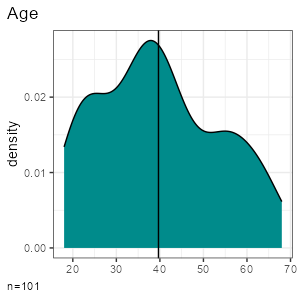
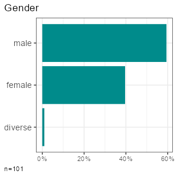
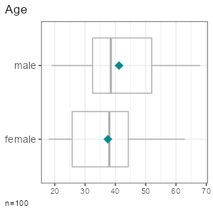
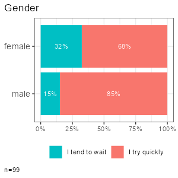
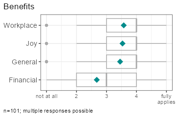
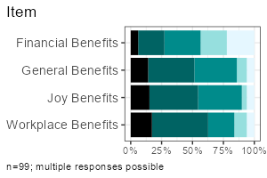

<!-- README.md is generated from README.Rmd. Please edit that file -->

# volkeR-Package 

<!-- badges: start -->

<!-- badges: end -->

High-level functions for tabulating, charting and reporting survey data.

## Getting started

    # Install the package (see below), then load it
    library(volker)

    # Load example data from the package
    data <- volker::chatgpt

    # Create your first plot, counting answers to an item battery
    plot_counts(data, starts_with("cg_adoption_social"))

    # Create your first table, summarising the item battery
    tab_metrics(data, starts_with("cg_adoption_social"))

See further [examples in the introduction
vignette](vignettes/introduction.Rmd).

Don’t miss the template feature: Within RStudio, create a new Markdown
document, select `From template`, choose and finally knit the **volkeR
Report**! It’s a blueprint for your own tidy reports.

## Concept

The volkeR package is made for creating quick and easy overviews about
datasets. It handles standard cases with a handful of functions.
Basically you select one of the following functions and throw your data
in:

- **Charts**: `plot_metrics()` and `plot_counts()`  
- **Tables**: `tab_metrics()` and `tab_counts()`  
- **Reports**: `report_metrics()` and `report_counts()`

Which one is best? That depends on your objective:

- *Table or plot?*  
  A plot is quick to capture, data from a table is better for further
  calculations. Functions for tables start with `tab`, functions for
  plots with `plot`. If in doubt, create both at once with the
  `report`-functions.

- *Categorical or metric variables?*  
  Categories can be counted, for metric variables distribution
  parameters such as the mean and standard deviation are calculated.
  Functions for categorical variables contain `counts` in their name,
  those for metric `metrics`.

- *Individual or grouped?*  
  Groups can be compared (e.g., the average age by gender) or
  cross-tabulated (e.g. combinations of education level and gender) by
  providing a grouping column as third parameter of table, plot and
  report functions.

- *One variable or item batteries?*.  
  Item batteries are often used in surveys. Each item results in a
  single variable, but the variables are all measured with the same
  scale (e.g. 1 = not at all to 5 = fully applies). To summarise
  multiple items send a column selection to the functions by using
  tidyselect mechanisms such as `starts_with()`. Indexes are
  automatically calculated by the `report`-functions or can be
  explicitly created using `add_idx()`.

- *Markdown or data frame?*  
  All table functions return data frames that can be processed further.
  The tables have their own print function, so the output of all
  functions can be used directly in Markdown documents to display neatly
  formatted tables and plots. The `report`-functions create tidy
  interactive tabsheets to switch between plots, tables, and indexes.

## Examples

<table>
<tbody>
<tr>
<td>
</td>
<td>
<strong>Metric</strong>
</td>
<td>
<strong>Categorical</strong>
</td>
</tr>
<tr>
<td>
<strong style="display: block;transform: rotate(-90deg);">One
variable</strong>
</td>
<td valign="top">

</td>
<td valign="top">

</td>
</tr>
<tr>
<td>
<strong style="display: block;transform: rotate(-90deg);">Group
comparison </strong>
</td>
<td valign="top">

</td>
<td valign="top">

</td>
</tr>
<tr>
<td>
<strong style="display: block;transform: rotate(-90deg);">Multiple
items</strong>
</td>
<td valign="top">

</td>
<td valign="top">

</td>
</tr>
</tbody>
</table>

 

All functions take a data frame as their first argument, followed by
column selections, and optionally a grouping column. Examples:

- One metric variable: `tab_metrics(data, sd_age)`  
- One categorical variable: `tab_counts(data, sd_gender)`  
- Grouped metric variable: `tab_metrics(data, sd_age, sd_gender)`  
- Grouped categorical variable:
  `tab_counts(data, in_adoption, sd_gender)`  
- Multiple metric variables:
  `tab_metrics(data, starts_with("cg_adoption"))`  
- Multiple categorical variables:
  `tab_counts(data, starts_with("cg_adoption"))`

**Hint**: replace `tab_` by `plot_` to reproduce the examples above.
You’ll find an overview about different [tables](vignettes/tables.Rmd),
[plots](vignettes/plots.Rmd) and [reports](vignettes/reports.Rmd) in the
package vignettes. For further options to customize the results, see the
builtin function help (F1 key).

After deciding whether to plot or tabulate, and whether to handle metric
or counted data, the column selections determine which of the following
methods are called under the hood. (Note: Some are not implemented yet.)

| \#  | function                   | implemented | output | scale   | columns  | crossings  |
|-----|----------------------------|-------------|--------|---------|----------|------------|
| 1   | tab_counts_one             |             | table  | counts  | one      |            |
| 2   | tab_counts_one_grouped     |             | table  | counts  | one      | grouped    |
| 3   | tab_counts_items           |             | table  | counts  | multiple |            |
| 4   | tab_counts_items_grouped   | not yet     | table  | counts  | multipe  | grouped    |
| 5   | tab_counts_items_cor       | not yet     | table  | counts  | multipe  | correlated |
| 6   | tab_metrics_one            |             | table  | metrics | one      |            |
| 7   | tab_metrics_one_grouped    |             | table  | metrics | one      | grouped    |
| 8   | tab_metrics_items          |             | table  | metrics | multiple |            |
| 9   | tab_metrics_items_grouped  |             | table  | metrics | multipe  | grouped    |
| 10  | tab_metrics_items_cor      |             | table  | metrics | multipe  | correlated |
| 11  | plot_counts_one            |             | plot   | counts  | one      |            |
| 12  | plot_counts_one_grouped    |             | plot   | counts  | one      | grouped    |
| 13  | plot_counts_items          |             | plot   | counts  | multiple |            |
| 14  | plot_counts_items_grouped  | not yet     | plot   | counts  | multipe  | grouped    |
| 15  | plot_counts_items_cor      | not yet     | plot   | counts  | multipe  | correlated |
| 16  | plot_metrics_one           |             | plot   | metrics | one      |            |
| 17  | plot_metrics_one_grouped   |             | plot   | metrics | one      | grouped    |
| 18  | plot_metrics_items         |             | plot   | metrics | multiple |            |
| 19  | plot_metrics_items_grouped |             | plot   | metrics | multipe  | grouped    |
| 20  | plot_metrics_items_cor     | not yet     | plot   | metrics | multipe  | correlated |

## Where do all the labels go?

One of the strongest package features is labeling. You know the pain.
Labels are stored in the column attributes. Inspect current labels of
columns and values by the `codebook()`-function:

    codebook(data)

This results in a table with item names, item values, value names and
value labels. The same table format can be used to manually set labels
with `labs_apply()`:

    newlabels <- tribble(
      ~item_name,                 ~item_label,
      "cg_adoption_advantage_01", "Allgemeine Vorteile",
      "cg_adoption_advantage_02", "Finanzielle Vorteile",
      "cg_adoption_advantage_03", "Vorteile bei der Arbeit",
      "cg_adoption_advantage_04", "Macht mehr Spaß"
    )

    data %>%
      labs_apply(newlabels) %>%
      tab_metrics(starts_with("cg_adoption_advantage_"))

Be aware that some data operations such as `mutate()` from the Tidyverse
loose labels on their way. In this case, store the labels (in the
codebook attribute of the data frame) before the operation and resotre
them afterwards:

    data %>%
      
      labs_store() %>%
      mutate(sd_age = 2024 - sd_age) %>% 
      labs_restore() %>% 
      
      tab_metrics(sd_age)

## Sosci Survey integration

The labeling mechanisms follow a technique used, for example, on [Sosci
Survey](https://www.soscisurvey.de/). Sidenote for techies: Labels are
stored in the column attributes. That’s why you can directly throw in
labeled data from the Sosci Survey API:

    library(volker)

    # Get your API link from Sosci Survey with settings "Daten als CSV für R abrufen"
    eval(parse("https://www.soscisurvey.de/YOURPROJECT/?act=YOURKEY&rScript", encoding="UTF-8"))

    # Recode -9 values and prepare the codebook
    ds = volker::prepare(ds)

    # Generate reportings
    report_counts(ds, A002)

For best results, use sensible prefixes and captions for your Sosci
questions. The labels come directly from your questionnaire.

## Index calculation

Indexes (=mean of multiple items) can be added using `add_idx()`
manually and are automatically calculated in report functions.
Cronbach’s alpha is added to all table outputs.

## Installation

As with all other packages you’ll have to install the package first. You
can install the development version from GitHub using remotes (if asked,
skip the updates):

    if (!require(remotes)) { install.packages("remotes") }
    remotes::install_github("strohne/volker")

After installing the package, load it:

    library(volker)

Finally, use it:

    # Example data
    data <- volker::chatgpt

    # Example table
    tab_metrics(data, sd_alter, sd_geschlecht)

**Hint:** To get the vignettes (= guides to the package, they help
getting started), you need to build them in the install process. Only
then, you’ll find them linked in the help index page.

    remotes::install_github("strohne/volker", build_vignettes = T)

## Special features

- Simple tables, simple plots, simple reports.  
- Labeling and scaling based on attributes. Appropriate attributes, for
  example, are provided by the Sosci Survey API. Alternatively, you can
  add custom labels. Use `codebook()` to see all labels present in a
  dataset.  
- Interactive reports: Use the `volker::html_report` template in your
  Markdown documents to switch between tables and plots when using the
  report-functions.  
- Calculate metric indexes using `add_idx()` (*work in progress*).  
- Simplified hints for wrong parameters, e.g. if you forget to provide a
  data frame (*work in progress*).
- Tidyverse style.

## Troubleshooting

The kableExtra package produces an error in R 4.3 when knitting
documents: `.onLoad in loadNamespace() für 'kableExtra' fehlgeschlagen`.
As a work around, remove PDF and Word settings from the output options
in you markdown document (the yml section at the top). Alternatively,
install the latest development version:

    devtools::install_github("kupietz/kableExtra")

## Roadmap

| Version | Features          | Status           |
|---------|-------------------|------------------|
| 1.0     | Descriptives      | work in progress |
| 2.0     | Regression tables | work in progress |
| 3.0     | Topic modeling    | work in progress |

## Similar packages

The volker package is inspired by outputs used in the the textbook
[Einfache Datenauswertung mit
R](https://doi.org/10.1007/978-3-658-34285-2) (Gehrau & Maubach et al.,
2022), which provides an introduction to univariate and bivariate
statistics and data representation using RStudio and R Markdown.

Other packages with high-level reporting functions:  
- <https://github.com/joon-e/tidycomm>  
- <https://github.com/kassambara/rstatix>

## Authors and citation

**Author**  
Jakob Jünger (University of Münster)

**Contributers**  
Henrieke Kotthoff (University of Münster)  
Chantal Gärtner (University of Münster)

**Citation**  
Jünger, J. (2024). volker: High-level functions for tabulating, charting
and reporting survey data. R package version 1.0.
