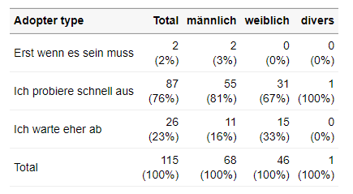

# VolkeR-Package

*Work in progress: nicht alles ist bereits umgesetzt!*

## Concept

Das VolkeR-Package ist dafür gemacht, schnelle und einfache Übersichten über Datensätze zu erstellen. 
Es ist besonders für Befragungsdaten geeignet. Überlegen Sie sich vor der Auswahl der Funktionen:

- *Tabelle oder Grafik?*  
  Eine Grafik ist schnell zu erfassen, mit den Daten einer Tabelle lässt sich besser weiterrechnen. Erstellen Sie im Zweifelsfall beides.
  Funktionen für Tabellen beginnen mit `tab`, Funktionen für Grafiken (noch in Arbeit) mit `plot`.
  
- *Kategoriale oder metrische Variablen?*   
  Kategorien kann man zählen, für metrische Variablen werden Verteilungsparameter wie der Mittelwert und die Standardabweichung berechnet.
  Funktionen für kategoriale Variablen enthalten im Namen `counts`, die für metrische `metrics`.
  
- *Eine Variable oder Item-Batterien?*  
  Bei Befragungen werden häufig Item-Batterien eingesetzt. Jedes Item resultiert in einer einzelnen Variable, die Variablen sind aber alle mit der gleichen Skala gemessen.
  Alle Items lassen sich übersichtlich in einer Tabelle zusammenfassen: entweder indem man mit `tab_item_counts()` die Ausprägungen für jedes Item zählt (z.B. 1=überhaupt nicht bis 5=voll und ganz) 
  oder indem man mit `tab_item_metrics()` Verteilungsparameter berechnet (z.B. Mittelwert der Antworten, die jeweils von 1 bis 5 gehen). 
  
- *Einfach oder gruppiert?*  
  Werden metrische Variablen gruppiert, lassen sich Gruppen vergleichen (z.B. der Altersdurchschnitt je Geschlecht), dafür gibt es die Funktion `tab_group_metrics()`.
  Werden kategoriale Variablen gruppiert, entstehen Kreuztabellen (z.B. Kombinationen aus Bildungsgrad und Geschlecht), die mit `tab_group_counts()` erstellt werden können.  
  Um Zusammenhänge zwischen vielen Variablen darzustellen, können entweder mit `tab_multi_means()` alle Mittelwerte von Items zwischen Gruppen verglichen werden oder mit `tab_multi_corr()` Korrelationsmatrizen ausgegeben werden.

- *Markdown oder Dataframe?*  
  Alle Tabellenfunktionen geben Dataframes zurück, die in Objekten abgelegt und weiterverarbeitet werden können. Die Tabellen verfügen über eine eigene print-Funktion, sodass der Output aller Funktionen direkt in Markdown-Dokumenten eingesetzt werden kann, um formatierte Tabellen auszugeben. Dazu muss im Code-Chunk der Parameter `results='asis'` gesetzt werden, siehe die [Beispiele in der Vignette](vignettes/introduction.Rmd). 

## Special features

- Labeling of table outputs
- Tidyverse column selection

## Examples

*Frequencies and distributions (univariable)*  

<table>
<tbody>
<tr>
<td></td>
<td><strong>Metric</strong></td>
<td><strong>Categorical</strong></td>
</tr>
<tr>
<td><strong style="display: block;transform: rotate(-90deg);">One variable</strong></td>
<td valign="top"><code>tab_var_metrics()</code><br></td>
<td valign="top"><code>tab_var_counts()</code><br></td>
</tr>
<tr>
<td><strong style="display: block;transform: rotate(-90deg);">Multiple items</strong></td>
<td valign="top"><code>tab_item_metrics()</code><br></td>
<td valign="top"><code>tab_item_counts()</code><br></td>
</tr>
</tbody>
</table>

*Correlations and comparisons (multivariable)*  

<table>
<tbody>
  <tr>
    <td></td>
    <td><strong>Metric & x</strong></td>
    <td><strong>Categorical & x</strong></td>
  </tr>
  <tr>
    <td><strong style="display: block;transform: rotate(-90deg);">Two variables</strong></td>
    <td valign="top"><code>tab_group_metrics()</code><br></td>
    <td valign="top"><code>tab_group_counts()</code><br></td>
  </tr>
  <tr>
    <td><strong style="display: block;transform: rotate(-90deg);">Multiple items</strong></td>
    <td valign="top"><code>tab_multi_corr()</code><br></td>
    <td valign="top"><code>tab_multi_means()</code><br></td>
  </tr>
</tbody>
</table>
<br>
<br>


All functions take a data frame as their first argument, followed by column selections, e.g.:  

```
tab_multi_means(
  data,
  starts_with("cg_adoption_advantage"),
  sd_gender
)
```

For more example code, see the [introductionary vignette](vignettes/introduction.Rmd). 


## Installation
As with all other packages you'll have to install the package and load the library first.

```
library(devtools)
install_github("strohne/volker")
```

Alternative using remotes:
```
if (!require(remotes)) { install.packages("remotes") }
remotes::install_github("strohne/volker")
```

After installing the package, load it:
```
library(volker)
```
  
## Troubleshooting

The kableExtra package produces an error in R 4.3 when knitting documents: ` .onLoad in loadNamespace() für 'kableExtra' fehlgeschlagen`. As a work around, remove PDF and Word settings from the output options in you markdown document (the yml section at the top).

## Roadmap


| Version | Features               | Status           |  
| ------- | ---------------------- | ---------------- |  
| 1.0     | Descriptive tables     | work in progress | 
| 1.1     | Descriptive plots      | work in progress |  
| 1.2     | Regression tables      | work in progress |  
| 1.3     | SosciSurvey integration | work in progress |  

## Similar packages

https://github.com/kassambara/rstatix


## Authors and citation

Maintainer: Jakob Jünger. 
Code assistent: Henrieke Kotthoff.
