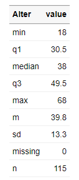
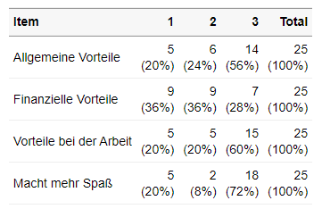
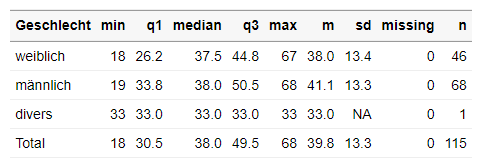

# VolkeR-Package

**Work in progress: nicht alles ist bereits umgesetzt!*

## Concept

Das VolkeR-Package ist dafür gemacht, schnelle und einfache Übersichten über Datensätze zu erstellen. 
Es ist besonders für Befragungsdaten geeignet. Überlegen Sie sich vor der Auswahl der Funktionen:

- Tabelle oder Grafik? 
  Eine Grafik ist schnell zu erfassen, mit den Daten einer Tabelle lässt sich besser weiterrechnen. Erstellen Sie im Zweifelsfall beides.
  Funktionen für Tabellen beginnen mit `tab_`, Funktionen für Grafiken mit `plot_`.
  
- Kategoriale oder metrische Variablen? 
  Kategorien kann man zählen, für metrische Variablen werden Verteilungsparameter wie der Mittelwert und die Standardabweichung berechnet.
  Funktionen für kategoriale Variablen beginnen mit `tab_counts_` / `plot_counts_`, die für metrische mit `tab_metrics_` / `plot_metrics_`.
  
- Eine Variable oder Item-Batterien? 
  Bei Befragungen werden häufig Item-Batterien eingesetzt. Jedes Item resultiert in einer einzelnen Variable, die Variablen sind aber alle mit der gleichen Skala gemessen.
  Alle Items lassen sich übersichtlich in einer Tabelle zusammenfassen: entweder indem man die Ausprägungen für jedes Item zählt (z.B. 1=überhaupt nicht bis 5=voll und ganz) 
  oder indem man Verteilungsparameter berechnet (z.B. Mittelwert der Antworten, die jeweils von 1 bis 5 gehen).
  
  Wenn mehrere Variablen ausgewertet werden sollen, dann wird dies im ersten Parameter der Funktionen angegeben.
  
- Einfach oder gruppiert?
  Werden metrische Variablen gruppiert, lassen sich Gruppen vergleichen (z.B. der Altersdurchschnitt je Geschlecht).
  Werden kategoriale Variablen gruppiert, entstehen Kreuztabellen (z.B. Kombinationen aus Bildungsgrad und Geschlecht).

- Gruppen untereinander oder nebeneinander?

- Markdown oder Dataframe?


## Examples


|  | | |
|----------------------------------------|--------------------------------------------|---|
|                    |       metrisch                                     |  kategorial |
|**Eine Variable**                                 |  `tab_var_metrics()` |  `tab_var_counts()` |
|                      |   metrisch                                         | kategorial  |
| **Mehrere Items**                                    |  `tab_item_metrics()` |  `tab_item_count()` |
|                      |  metrisch & kategorial                                      | metrisch & kategorial   |
|       **Zwei Variablen**                                 |  `tab_group_metrics()` |  `tab_multi_means()` |


**to be continued** 

## Installation
As with all other packages you'll have to install the package and load the library first.

```
library(devtools)
install_github("strohne/volker")
```

Alternative using remotes:
```
if (!require(remotes)) { install.packages("remotes") }
remotes::install_github("strohne/volker")
```

After installing the package, load it:
```
library(volker)
```
  
## Troubleshooting

The kableExtra package produces an error in R 4.3 when knitting documents: ` .onLoad in loadNamespace() für 'kableExtra' fehlgeschlagen`. As a work around, remove PDF and Word settings from the output options in you markdown document (the yml section at the top).


## Authors and citation

Maintainer: Jakob Jünger. 
Code assistent: Henrieke Kotthoff.
