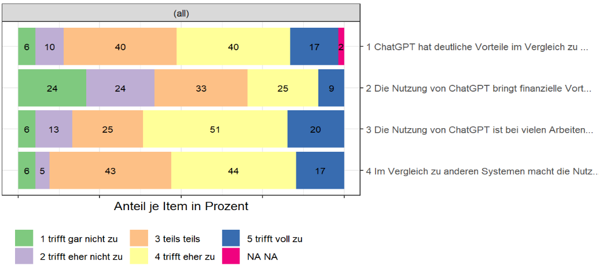
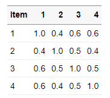

# VolkeR-Package

**Work in progress: nicht alles ist bereits umgesetzt!*

## Concept

Das VolkeR-Package ist dafür gemacht, schnelle und einfache Übersichten über Datensätze zu erstellen. 
Es ist besonders für Befragungsdaten geeignet. Überlegen Sie sich vor der Auswahl der Funktionen:

- Tabelle oder Grafik? 
  Eine Grafik ist schnell zu erfassen, mit den Daten einer Tabelle lässt sich besser weiterrechnen. Erstellen Sie im Zweifelsfall beides.
  Funktionen für Tabellen beginnen mit `tab_`, Funktionen für Grafiken mit `plot_`.
  
- Kategoriale oder metrische Variablen? 
  Kategorien kann man zählen, für metrische Variablen werden Verteilungsparameter wie der Mittelwert und die Standardabweichung berechnet.
  Funktionen für kategoriale Variablen beginnen mit `tab_counts_` / `plot_counts_`, die für metrische mit `tab_metrics_` / `plot_metrics_`.
  
- Eine Variable oder Item-Batterien? 
  Bei Befragungen werden häufig Item-Batterien eingesetzt. Jedes Item resultiert in einer einzelnen Variable, die Variablen sind aber alle mit der gleichen Skala gemessen.
  Alle Items lassen sich übersichtlich in einer Tabelle zusammenfassen: entweder indem man die Ausprägungen für jedes Item zählt (z.B. 1=überhaupt nicht bis 5=voll und ganz) 
  oder indem man Verteilungsparameter berechnet (z.B. Mittelwert der Antworten, die jeweils von 1 bis 5 gehen).
  
  Wenn mehrere Variablen ausgewertet werden sollen, dann wird dies im ersten Parameter der Funktionen angegeben.
  
- Einfach oder gruppiert?
  Werden metrische Variablen gruppiert, lassen sich Gruppen vergleichen (z.B. der Altersdurchschnitt je Geschlecht).
  Werden kategoriale Variablen gruppiert, entstehen Kreuztabellen (z.B. Kombinationen aus Bildungsgrad und Geschlecht).

- Gruppen untereinander oder nebeneinander?

- Markdown oder Dataframe?


## Examples

**Eine Variable**

Mit `tab_var_metrics()` wird eine tabellarische Übersicht der Verteilung einer metrischen Variable erstellt. 
Mit `tab_var_counts()` wird eine Häufigkeitstabelle für eine kategoriale Variable erstellt. 

  

**Mehrere Items** 

Hier ist eine Itembatterie mit 5 Antwortmöglichkeiten (1-5) dargestellt. `tab_item_count()` erstellt eine Übersicht der Häufigkeiten der gegebenen Antworten. Äquivalent kann ein Plot mit `plot_counts()` erstellt werden. 

 


Mit `tab_item_metrics()` kann zudem eine Verteilungsübersicht der einzelnen Items erstellt werden. Genau wie bei der Verteilungsübersicht für eine Variable sind die Verteilungsparameter wie z.B. Mittelwert oder Quartile angegeben. 


**Zwei Variablen** 

Mit `tab_group_counts()` kann eine Kreuztabelle erstellt werden, die den Zusammenhang zwischen zwei kategorialen Variablen darstellt. Mit `plot_compare_factor()` kann der entsprechende Plot erstellt werden.


Mit `tab_group_metrics()` können Verteilungen zwischen Gruppen verglichen werden, wie zum Beispiel die Altersverteilung nach Geschlecht. Erneut sind die üblichen Verteilungsparameter angegeben.


Mit `tab_multi_means()` kann eine Tabelle erzeugt werden, die Mittelwerte einer kategorialen Variable (z.B. Geschlecht) für verschiedene Variablen (z.B. Variablen einer Itembatterie) darstellt. 


Wenn der Zusammenhang zwischen zwei metrischen Variablen betrachtet werden soll, können Korrelationswerte berechnet werden, die mit `tab_multi_corr()` in einer Korrelationstabelle abgebildet werden können. 



**to be continued** 

## Installation
As with all other packages you'll have to install the package and load the library first.

```
library(devtools)
install_github("strohne/volker")
```

Alternative using remotes:
```
if (!require(remotes)) { install.packages("remotes") }
remotes::install_github("strohne/volker")
```

After installing the package, load it:
```
library(volker)
```
  
  
## Authors and citation

Maintainer: Jakob Jünger. 
Code assistent: Henrieke Kotthoff.
